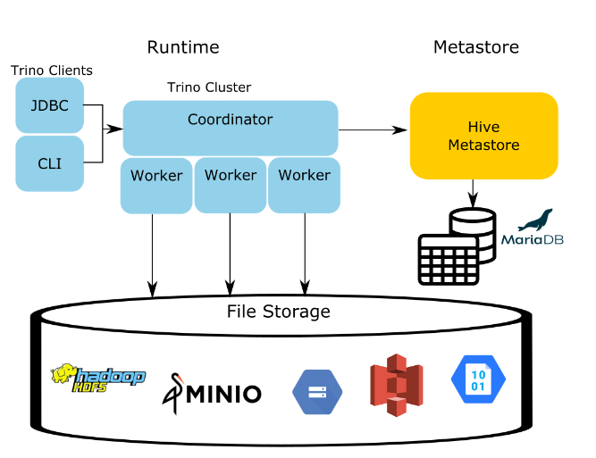

# Trino Example

This is a simple example intended to be used to gather requirements. [Trino](https://trino.io/) is a distributed SQL Query engine.  We're using it in this example to query data stored as parquet files in Cloud Storage buckets, and as BigQuery tables, and then visualing the query results with [Apache Superset](https://github.com/apache/superset). 

The idea is, if we have GCP Epi Workstations which are set up with RStudio and connected to data stored in Cloud Storage buckets, this could potentially be one solution to access federated data stored across various GCP projects and other locations. 

An advantage of Trino is that it's quick - it pushes queries down in parallel, using query planning and optimization, to be processed at the source(s) - passing only the query results back over the network. 

Trino acts as a translator, with the common query language being SQL.  This allows us to be able to query data from variety of sources with different query notations. 

Trino allows us to query data located in a multi-cloud set up.

To connect to data sources, we use connectors. Some of these connectors are native to Trino, like the BiqQuery connector, where as others use intermediate connectors eg Apache Hive to connect to sources like Google Cloud Storage. 

Superset is a data query and vizualization platform that can be used with Trino to explore the data and create new datasets.

## Note

This proof-of-concept is not yet in a fully working state.  While we are able to connect to BigQuery tables across various projects, we are only able at this point, to connect to one project's Cloud Storage Buckets at a time.
<!-- ## TODO

This PoC is using docker compose, to gather feedback, if this was to be used in production, we'd need to set up Trino and Hive Metastore service clusters.

 Issues have been recorded in this repo. 
- [X] Docker compose Trino locally (for now)  
- [X] Connect to BigQuery tables residing in different GCP projects
- [X] Add Hive metastore in order to use GCS conector (this works for one )
- [ ] Connect to Google Cloud Storage buckets in different projects. (able to connect to one, but not the other)
- [ ] Flush out authentication, authorization requirements and capabilities
- [ ] Visualize with Apache Superset -->


## To run 
1. Add service account(s) and generate service account keys for each GCP project - grant BigQuery and Google Cloud Storage permissions.  In this case we have lk-sa-key.json and te-sa-key.json.  Add these json key files to the root of this project.

2. Docker composer up. This generates a large quanity of logs, so we're writting the logs to file, rather than the terminal, in order to be able to view and search the log history.

```
docker compose build && docker compose up > docker-compose.log 2>&1
```

3. Once running (view status in docker-compose.log), in another terminal launch Trino; 
```
docker exec -it trino trino
```

### Trino CLI commands

Here are the cli commands:
https://trino.io/docs/current/client/cli.html

#### Example (Big Query)

```
show catalogs;
```
```
show schemas in tebq;
```
```
show tables in tebq.cansim_tables;
```
```
SELECT * from tebq.cansim_tables.life_expectancy limit 5;
```

#### Example - Cloud Storage

We need to first create the metadata table in hive metastore. 

```
CREATE SCHEMA IF NOT EXISTS tebucket.iris WITH (location = 'gs://bucket-in-other-project/iris');
```
```
CREATE TABLE IF NOT EXISTS tebucket.iris.iris_data (
  sepal_length DOUBLE,
  sepal_width  DOUBLE,
  petal_length DOUBLE,
  petal_width  DOUBLE,
  class        VARCHAR
)
WITH (
  external_location = 'gs://bucket-in-the-other-project/iris/',
  format = 'PARQUET'
);   
```
Then we can use. (and join with other datasets)
```
SELECT count(*) FROM tebucket.iris.iris_data LIMIT 10;
```


### Trino UI
Used to view query performance and who performed the query.
http://localhost:8080/ 

<!-- ### To debug

Docker log files are written to docker-compose.log. Alternatively, interactive shell into the containers.

```
docker exec -it trino /bin/sh
```
or 
```
docker exec -it hive-metastore /bin/sh
``` -->
### Superset 

Launch the browser, and log into the Superset UI:
```
localhost:8088
```
```
username: admin
password: admin
```

Connect each data source (catalog/ database), and add a dataset for each table [see Superset docs](https://superset.apache.org/docs/databases/trino/).

```
trino://trino@trino:8080/{catalog_name}
```

### Things to note 
 
* Use case insenstive flags in properties or use quotes " " around the table names if the table names start with numbers or contain '-' or special characters..

## To tear down 
```
docker compose down -v
```

## Configuration

### Trino

Trino uses [connectors](https://trino.io/docs/current/connector.html) to access external data sources. With this example, we're using the [BigQuery connector](https://trino.io/docs/current/connector/bigquery.html) using a json GCP sevice account credentials file (for now) for each catalog (eg each data source connection). We're also using the [Hive connector](https://trino.io/docs/current/connector/hive.html) in order to access files in google cloud storage as there's no native GCS connecter for Trino. 

Configuration files for each catalog are stored in [trino/etc/catalog](./trino/etc/catalog/) (per the connector docs (links above)). When we mount this folder to the /etc/trino/catalog location in the container, the other configuration defaults remain intact.


### Hive Metastore Service (HMS) 

The HMS provides a central repository of metadata.

For Trino, we're using the Hive metastore service rather than the full Hive distribution. See [this article](https://trino.io/blog/2020/10/20/intro-to-hive-connector.html) for an explaination why we're using just the metastore (and database).  Trino uses the hive connector for google cloud storage - which requires a little set up.

(Hive does have an internal database (Derby) that you could use, but here's we're using MariaDB (mySQL) based on the available examples.) 



Here are the [docs](https://cwiki.apache.org/confluence/display/Hive/AdminManual+Metastore+3.0+Administration#AdminManualMetastore3.0Administration-RunningtheMetastoreWithoutHive
) for hive metastore.

#### hive-metastore.xml

* Contains database connection credentials, thrift uri, and  modifications enable hive metastore standalone configuration.
<!-- (metastore.task.threads.always:	org.apache.hadoop.hive.metastore.events.EventCleanerTask,org.apache.hadoop.hive.metastore.MaterializationsCacheCleanerTask, metastore.expression.proxy:	org.apache.hadoop.hive.metastore.DefaultPartitionExpressionProxy) -->

#### core-site.xml

* contains GCP/ cloud connection credentials, hadoop file system   config and additional connection permissions for GCP in this case. 

#### Dockerfile 
* We need to include the [HDFS](https://community.cloudera.com/t5/Support-Questions/Installing-HDFS-Google-Cloud-Connector/td-p/56053 ) (hadoop distributed file system) and the [GCS connector](https://github.com/GoogleCloudDataproc/hadoop-connectors/blob/master/gcs/INSTALL.md) in the container image. 
* https://cloud.google.com/dataproc/docs/concepts/connectors/install-storage-connector


### [Superset](https://github.com/apache/superset) 

Use these resources to set up:
* [Superset releases](https://github.com/apache/superset/releases)
* [Quickstart](https://superset.apache.org/docs/quickstart)
* [Medium tutorial](https://medium.com/towards-data-engineering/quick-setup-configure-superset-with-docker-a5cca3992b28)

Note - Superset comes with MYSQL database driver, but for any other database connection, you will need to pip install the database driver in the Superset Dockerfile:
* database drivers https://superset.apache.org/docs/databases/installing-database-drivers/

#### UI
```
localhost:8088
```

Dataset
```
Presto
```

Connection sql uri: 
```
trino://hive-metastore@trino:8080/<catalog name - eg. tebq>
```

## Other Links and Resources 

### Trino
* [Trino docs](https://trino.io/docs/)
* [Trino docker](https://trino.io/docs/current/installation/containers.html)

* [Trino Github](https://github.com/trinodb/trino)
* https://trino.io/docs/current/connector/hive-gcs-tutorial.html
* https://trino.io/docs/current/object-storage/file-system-gcs.html

Trino - connecting to GCS
* [Trino Hive connector requirements ](https://trino.io/docs/current/connector/hive.html)
* https://trino.io/docs/current/connector/hive-gcs-tutorial.html
* https://ta.thinkingdata.cn/trino-docs/connector/hive-gcs-tutorial.html

Trino Authorization
* https://trino.io/docs/current/security/password-file.html
* https://trino.io/docs/current/security/oauth2.html

### Hive Metastore
Good explaination of using hive - need hive metadata service and database (and Hadoop distributed filesystem)
(we're using this example as a starting point this one)
* https://trino.io/blog/2020/10/20/intro-to-hive-connector.html

Hive quickstart docker image: 
* https://hive.apache.org/developement/quickstart/ 

Running metastore without Hive
* https://cwiki.apache.org/confluence/display/Hive/AdminManual+Metastore+3.0+Administration#AdminManualMetastore3.0Administration-RunningtheMetastoreWithoutHive

Configuring hive metastore service
* https://docs.cloudera.com/cdw-runtime/1.5.1/hive-metastore/topics/hive-configuring-hms.html

<!-- We *may need these properties
* JSON (using org.apache.hive.hcatalog.data.JsonSerDe)
* CSV (using org.apache.hadoop.hive.serde2.OpenCSVSerde) -->

Connect to Google Cloud Storage (with Hive Connector)

Configuration changes for gcs
* https://community.cloudera.com/t5/Community-Articles/Accessing-Google-Cloud-Storage-via-HDP/ta-p/248754 
* https://docs.cloudera.com/HDPDocuments/HDP3/HDP-3.1.0/bk_cloud-data-access/content/gcp-other-options.html ** 
* https://ta.thinkingdata.cn/trino-docs/connector/hive-gcs-tutorial.html
Google: Installing the Cloud Storage connector 
* https://cloud.google.com/dataproc/docs/concepts/connectors/install-storage-connector
* https://docs.cloudera.com/HDPDocuments/HDP3/HDP-3.1.0/bk_cloud-data-access/content/gcp-cluster-config.html

HortonWorks: Working with Google Cloud Storage
* https://docs.hortonworks.com/HDPDocuments/HDP3/HDP-3.1.0/bk_cloud-data-access/content/gcp-get-started.html

Cloudera: Configuring Google Cloud Storage Connectivity
* https://www.cloudera.com/documentation/enterprise/latest/topics/admin_gcs_config.html

Setting up gcs as warehouse directory
* https://cloud.google.com/dataproc-metastore/docs/hive-metastore
* https://community.cloudera.com/t5/Community-Articles/Accessing-Google-Cloud-Storage-via-HDP/ta-p/248754

## Examples
This is the one referred to in the [previous article](https://trino.io/blog/2020/10/20/intro-to-hive-connector.html), and the one we're using as a base here.  
* https://github.com/njanakiev/trino-minio-docker/tree/master

Hive metastore only
* https://github.com/naushadh/hive-metastore (when running this, the hive metastore container unfortuneatley  only has run.sh container - no other hive-metastore files (maybe error with script))
* https://medium.com/@adamrempter/running-spark-3-with-standalone-hive-metastore-3-0-b7dfa733de91
https://github.com/arempter/hive-metastore-docker

Superset
* https://medium.com/towards-data-engineering/quick-setup-configure-superset-with-docker-a5cca3992b28
* https://github.com/dgkatz/trino-hive-superset-docker (3 years old)
* https://github.com/sairamkrish/trino-superset-demo  with 
* https://sairamkrish.medium.com/visualize-parquet-files-with-apache-superset-using-trino-or-prestosql-511f18a37e3b
* https://www.youtube.com/watch?v=0NHUs-TERtk, https://www.youtube.com/watch?v=Dw_al_26F6o


<!-- 

### Example Trino Use


```
CREATE SCHEMA IF NOT EXISTS lkbucket.iris WITH (location = 'gs://bucket-in-lk-project-2/iris'); 
```

```
CREATE TABLE IF NOT EXISTS lkbucket.iris.iris_data (
  sepal_length DOUBLE,
  sepal_width  DOUBLE,
  petal_length DOUBLE,
  petal_width  DOUBLE,
  class        VARCHAR
)
WITH (
  external_location = 'gs://bucket-in-lk-project-2/iris/',
  format = 'PARQUET'
);      
```
```
SELECT count(*) FROM lkbucket.iris.iris_data;
```


```
CREATE SCHEMA IF NOT EXISTS lkbucket.people WITH (location = 'gs://bucket-in-lk-project-2/people'); 
```

```
CREATE TABLE IF NOT EXISTS lkbucket.people.people_data (
  first   VARCHAR,
  last    VARCHAR,
  age     VARCHAR
)
WITH (
  external_location = 'gs://bucket-in-lk-project-2/people/',
  format = 'CSV'
);      
```
```
SELECT * FROM lkbucket.people.people_data;
```


Other project 
```

CREATE SCHEMA IF NOT EXISTS tebucket.iris WITH (location = 'gs://bucket-in-other-project-3/iris'); 
```

```
CREATE TABLE IF NOT EXISTS tebucket.iris.iris_data (
  sepal_length DOUBLE,
  sepal_width  DOUBLE,
  petal_length DOUBLE,
  petal_width  DOUBLE,
  class        VARCHAR
)
WITH (
  external_location = 'gs://bucket-in-the-other-project/iris/',
  format = 'PARQUET'
);   
```
```
SELECT count(*) FROM tebucket.iris.iris_data;
```
 -->

<!-- 
https://github.com/hevoio/trino-hive


Maybe use this?? https://trino.io/docs/current/connector/hive-azure.html#advanced-configuration - a core-site.xml per storage account

https://trino.io/docs/current/connector/hive.html?highlight=core+site+xml


User guide for HDFS https://hadoop.apache.org/docs/current/hadoop-project-dist/hadoop-hdfs/HdfsUserGuide.html


https://ta.thinkingdata.cn/trino-docs/connector/hive-gcs-tutorial.html

https://trino.io/docs/current/connector/hive.html#:~:text=as%20you%20need%2C%20so%20if%20you%20have%20additional%20Hive%20clusters%2C

https://stackoverflow.com/questions/53443495/access-buckets-across-projects-in-gcp-using-hive -->

